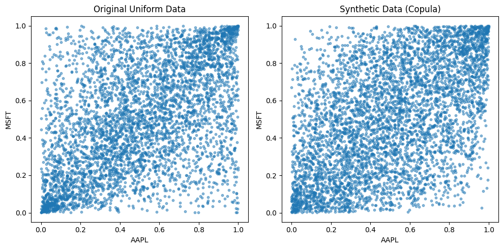
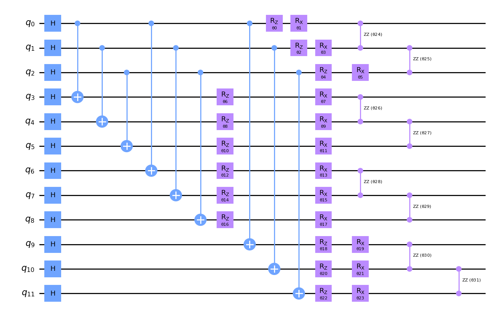

# Quantum Copulas Using Qiskit

This repository provides an implementation of **copula-based risk aggregation** using **Qiskit** and quantum computing, specifically tailored for **Quantum for Finance** applications. The project demonstrates how **Quantum Machine Learning** can model dependencies between financial assets, enhancing risk management strategies by leveraging trapped-ion quantum computers.

## Overview

Copulas are used in statistical models to describe dependencies between different random variables, and they have widespread applications in risk management, especially in finance. This project provides an implementation inspired by the original research paper **"Copula-based Risk Aggregation with Trapped Ion Quantum Computers"**, published in *Nature* by Dawei Zhu et al. This implementation replicates and extends the approach using **Qiskit**, a quantum computing framework developed by IBM.

### Original Paper

This work is inspired by the paper:

**[Copula-based Risk Aggregation with Trapped Ion Quantum Computers](https://www.nature.com/articles/s41598-023-44151-1)**  
Authors: Dawei Zhu, Weiwei Shen, Annarita Giani, Saikat Ray Majumder, Bogdan Neculaes, Sonika Johri  
Published in *Nature Scientific Reports*, 2023

The original paper explores the use of quantum copulas to aggregate risks using trapped-ion quantum computers, developed in collaboration with **IonQ Inc.** and **GE Research**.

### Authors of the Original Paper
- Dawei Zhu (IonQ Inc.)
- Weiwei Shen (GE Research)
- Annarita Giani (GE Research)
- Saikat Ray Majumder (GE Research)
- Bogdan Neculaes (GE Research)
- Sonika Johri (IonQ Inc.)

## Visualizations

### Original vs Synthetic Data (Copula)

The left plot shows the original uniform data of stock returns, and the right plot shows synthetic data generated using a copula model.

### Quantum Circuit for Copula Model

This quantum circuit is used to implement the copula-based risk aggregation model using trapped-ion quantum computers.
